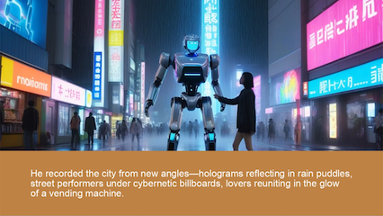

# video-generator
This project is designed to generate a video with subtitled imagery based on a provided body of text. This is accomplished using a five step process:

- The provided text is segmented into a series of consecutive captions that are broken up at the sentence level, and are designed to be of approximately equivalent length. These are then saved into a 'script', which is used in the remaining steps. The script is annotated with image markers, which are distributed using a configurable timing parameter.
- The lines of the script are run through a text-to-speech model to generate individual audio clips, which are saved as WAV files. TTS is performed using Kokoro.
- A LLM is used to write a description of the imagery throughout the script. Any LLM service that is compatible with the OpenAI chat completions API is supported. While [Ollama](https://github.com/ollama/ollama) does support the chat completions API, it has a limited context window when used this way. Therefore, the native Ollama API can be used instead by configuring `settings.USE_OLLAMA`.
- The imagery descriptions are then used as prompts for an image generation model, which creates images that correspond with various parts of the script. The image model is accessed through the [AUTOMATIC1111](https://github.com/AUTOMATIC1111/stable-diffusion-webui) (or [Forge](https://github.com/lllyasviel/stable-diffusion-webui-forge)) text2img API. Models that leverage T5 encoders for improved natural language prompt understanding, such as FLUX and SD3, may provide better results.
- The script and the generated images are used to structure, render, and export the final video. The basic format of the video includes each line of text displayed at the bottom in front of a flat background, while the corresponding image pans across the screen above. The images crossfade between each other as the script progresses. TTS audio clips are added to each clip of the video, and `audio.mp3` is added over the entire final video if the file is found in the chosen subdirectory.

Many settings at each step of the process can be modified and customized in `settings.py`. To generate a video, first ensure your `story.txt` file is in a subdirectory of `/content`. The sample file `/content/sample/story.txt` is provided as an example. Then, run `generate_video.py` with the subdirectory name as the first argument. If the argument is not provided, it will fall back to the subdirectory name provided through `settings.STORY_NAME`. A frame from a video generated from the sample file is provided below.

  

While the process described above will by default run all five steps, it is simple to modify which steps are run by commenting out each call in `generate_video.py`. For example, it is possible to provide a manually segmented script file, pre-written image prompts, or image set. Because the output of each step is saved into the relevant subdirectory, this also makes it possible to run each step independently, potentially at different times.